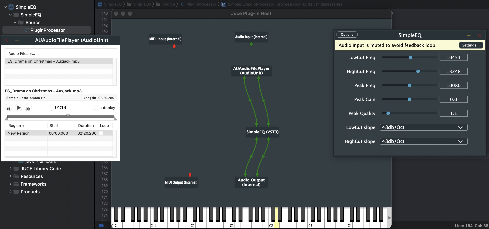

# Learning Modern C++
## Building Audio plugin with the JUCE Framework 
 - The plugin will have mono(1) and stereo(2) Chanel 
 - Will use low cut and high cut filter frequences(IIR filter)
 - Will add sliders to the GUI
 - Draw the response curve Grid
 - Add Spectrum Analyzer
 - Bypass Buttons
 
 
 
 
